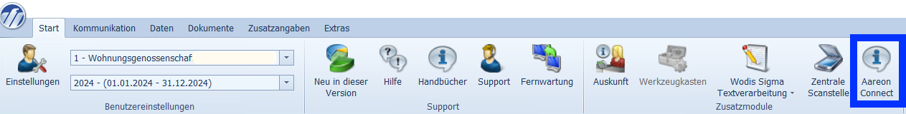
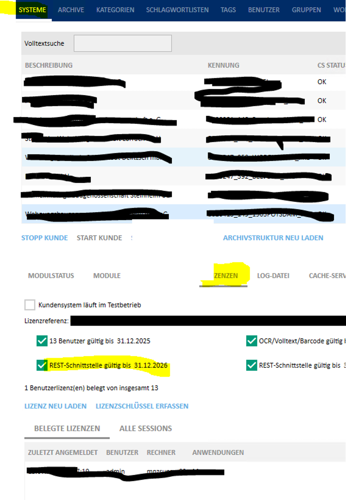

# Wodis Sigma

## Aareon Connect in Wodis Sigma aktivieren

### 1. Lizenzen Einlesen

Nachdem Sie den Aareon Connect Vertrag unterschrieben haben muss die Lizenz noch in Wodis Sigma eingespielt werden werden:

1. Gehen Sie auf den Reiter **Start**
2.  Klicken Sie auf **Neu in dieser Version**

    <figure><figcaption></figcaption></figure>
3. Der Browser öffnet sich automatisch und führt Sie auf die Wodis Sigma Anwendungsserver Seite
4. Klicken Sie auf **Lizenzen**
5. Loggen Sie sich mit Ihrem Benutzer und Passwort ein
6. Klicken Sie auf **autom. Aktualisierung**
7.  Klicken Sie auf **Übernehmen**

    <figure><figcaption></figcaption></figure>
8.  Nach der Lizenzaktualisierung müssen Sie die Module den entsprechenden Benutzern zuordnen

    (frühestens zehn Minuten nach der Aktualisierung).
9. Dazu müssen Sie Wodis Sigma neu starten und sich (mit Admin-Rechten) neu anmelden.
10. Gehen Sie auf **Administration** > **Konfiguration** > **Stammdaten** >

    **Benutzer**
11. Wählen Sie jeweils die Benutzer aus, die Zugang erhalten sollen
12. Klicken Sie unter **Benutzerrechte** die Checkbox bei **Locoia-Administrator** an

    <figure><figcaption></figcaption></figure>
13. Gehen Sie auf **Administration** > **Konfiguration** > **Stammdaten** > **Zuordnungen** >

    **Benutzer – Applikation**
14. Wählen Sie jeweils die Benutzer aus, die Zugang erhalten sollen
15. Verschieben Sie das Modul **Integrations Platform as a Service** mit dem Einzelpfeil von links nach rechts\

    <figure><figcaption></figcaption></figure>

### 2. Aareon Connect öffnen

Um Aareon Connect in Wodis Sigma zu öffnen und somit Integrationen zu aktivieren müssen Sie auf das **Start** Menü gehen und dort, ganz rechts, auf **Aareon Connect** klicken:

<figure><figcaption></figcaption></figure>


Wenn der **Aareon Connect** Button ausgegraut ist, sind die Lizenzen noch nicht richtig eingespielt.

Kontaktieren Sie bei Fragen dazu gerne den Wodis Sigma Support.


Dann geht Aareon Connect in einem Browser Fenster auf.


Wenn die Partner Logos in Aareon Connect nicht angezeigt werden, dann werden diese von Ihrem Server blockiert und es werden ebenfalls andere wichtige Funktionen blockiert.

In dem Fall müssen Sie die Aareon Connect URL kopieren und außerhalb der Wodis Server Umgebung in einem anderem Browser öffnen.

Diese URL ist aus Sicherheitsgründen nur einige Stunden gültig, entsprechend können Sie sich diese _nicht_ abspeichern.&#x20;


## Use Cases

### Stammdaten

#### Besonderheiten

* Die Synchronisierung der Daten in das Partnersystem erfolgt jeden Sonntag, Dienstag, und Donnerstag
* Die Etagennummer (`unit_floor`) wird wie folgt ermittelt:

| Etage/Lage (Wodis Sigma)    | Etagennummer         | Beispiel                      |
| --------------------------- | -------------------- | ----------------------------- |
| Nicht angegeben             | _Leer_               | _Leer_ -> _Leer_              |
| Enthält "Erdgeschoss"       | 0                    | Erdgeschoss, links -> 0       |
| Enthält "Keller"            | -1                   | Keller, links -> -1           |
| Ist eine Zahle              | Die Zahl             | 2 -> 2                        |
| Zahl kann extrahiert werden | Die extrahierte Zahl | 3. Etage, links -> 3          |
| Keine Zahlen gefunden       | _Leer_               | Dachgeschoss, mitte -> _Leer_ |


Alle Prüfungen sind unabhängig von Groß-und Kleinschreibung und werden in der dargestellten Reihenfolge ausgeführt (d.h. wenn "Erdgeschoss" gefunden wurde, werden die weiteren Prüfungen nicht mehr ausgeführt).


### Leerstände und Interessenten

Alle ERP spezifischen Details sind identisch zu denen bei [Wodis Yuneo, welche hier beschrieben sind](wodis-yuneo.md#leerstande).

### Dokumente

Bei Wodis Sigma läuft der Dokumente Use Case immer direkt über die AAK Schnittstelle und nicht über die Wodis Sigma Schnittstelle selber.

Entsprechend ist die zusätzliche [#einrichtung-in-wodis-sigma-und-archiv-manager](wodis-sigma.md#einrichtung-in-wodis-sigma-und-archiv-manager "mention") nötig.

Im Zuge der Aktivierung des Dokumenten Use Cases, müssen Sie folgende Tabelle ausfüllen:

Im Zuge der Aktivierung des Dokumenten Use Cases, müssen Sie folgende Einstellungen ausfüllen:

#### Archive&#x20;

Bei der Bereitstellung von Dokumenten in einer Mieter- oder Eigentümer-App muss definiert werden, aus welchen Archiven Dokumente veröffentlicht werden, damit der Mieter oder Eigentümer keine Dokumente erhält, die nur für den internen Gebrauch vorgesehen waren. Bitte übergeben Sie uns eine Liste der Archive, aus denen wir die Dokumente veröffentlichen sollen. Nutzen Sie dazu bitte dieses [Formular](https://ivlv.me/QpPEO).

| Zuordnungen                                           | Archivnamen                                                                                            |
| ----------------------------------------------------- | ------------------------------------------------------------------------------------------------------ |
| Archive, die dem Mieter zugeordnet werden sollen      | 
z.B. :

„Mietvertag“

„SEPA-Lastschrift“

usw.
                                   |
| Archive, die den Eigentümern zugeordnet werden sollen | 
z.B.:

„Eigentümerverträge“

„Eigentümerversammlung“

„WEG-Beschluss“

usw.
 |

Eine Übersicht der der Archive und Indizes finden Sie in Wodis Sigma, im Archiv kompakt Manager und auch im Archiv kompakt Client

1. **Wodis Sigma**&#x20;

In Wodis Sigma finden Sie die Archive (Dokumententypen) im Modul Dokumentenmanagement - Dokumententypen

<figure><figcaption></figcaption></figure>

2. **Kompakt Manager- hier haben nur Admins Zugang**

&#x20;

<figure><figcaption></figcaption></figure>

**Archive**

Im Menüband oben unter Archive werden die Einträge angezeigt

<figure><figcaption></figcaption></figure>

&#x20;**3. Kompakt Client**

Öffnen Sie den **Kompakt Client**

<figure><figcaption></figcaption></figure>

**Archive**

Im Register Recherche oder Archivierung werden die Archive in den Suchkategorien oder auch in der Mitte unter dem Suchfeld Archiv angezeigt. Hier ein Demo-Archiv. Die Namen stimmen nicht mit Ihren überein.

<figure><figcaption></figcaption></figure>

#### Einrichtung in Wodis Sigma und **Archiv-Manager**

**Wodis Sigma**

1. Legen Sie einen Sachbearbeiter an
   1. _Hinweis_: PLZ, Ort und Land muss eingetragen werden
   2. Klicken Sie auf **Speichern**

<figure><figcaption></figcaption></figure>

2. Legen Sie einen Benutzer an
   1. Ordnen Sie diesem einen Sachbearbeiter zu
   2. Tragen Sie folgende Benutzerrechte ein:
      1. Administrator Archivierung
      2. Locoia Administrator
   3. Klicken Sie auf **Speichern**

<figure><figcaption></figcaption></figure>

3. Weisen Sie dem Benutzer der passenden Organisationseinheit (Mandanten) zu
   1. Angelegten Benutzer auswählen
   2. Häkchenfeld setzen
   3. Klicken Sie auf **Speichern**

&#x20;

4. Ordnern Sie dem Benutzer folgende Applikation zuL
   1. Alle Module, in denen „Archivierung“ vorkommt zuweisenL
      1. Archivierung (Aareon DMS)
      2. Archivierung (Teil1)
      3. Archivierung (Teil2)
         1. _Hinweis_: Dies ist nicht immer vorhanden

<figure><figcaption></figcaption></figure>

5. Dokumentenmanagement-> Rechteverwaltung
   1. Auf BG-Admin klicken  &#x20;
   2. Angelegten Benutzer zuordnen
   3. Klicken Sie auf **Speichern**

<figure><figcaption></figcaption></figure>


Mit den Zugangsdaten vom Benutzer erneut an Wodis anmelden und das Passwort ändern!

Die Anmeldung in Aareon Connect läuft sonst auf einen Fehler.


**Archiv-Manager**

1. Im Archiv-Manager
   1. Benutzer: schauen, ob der Benutzer die zugeordnete Gruppe BG-Admin hat (falls die fehlt den Schritt 5. in Wodis nachholen)
   2. In Anwendungsrechte: Das Anwendungsrecht REST-SS zuweisen&#x20;

<figure><figcaption></figcaption></figure>

<figure><figcaption></figcaption></figure>

2.  Archiv-Manager > Systeme > Lizenzen

    1. Prüfen, ob die Lizenz für REST-SS freigeschaltet ist
    2. Falls nein, Aareon kontaktieren

    <figure><figcaption></figcaption></figure>
