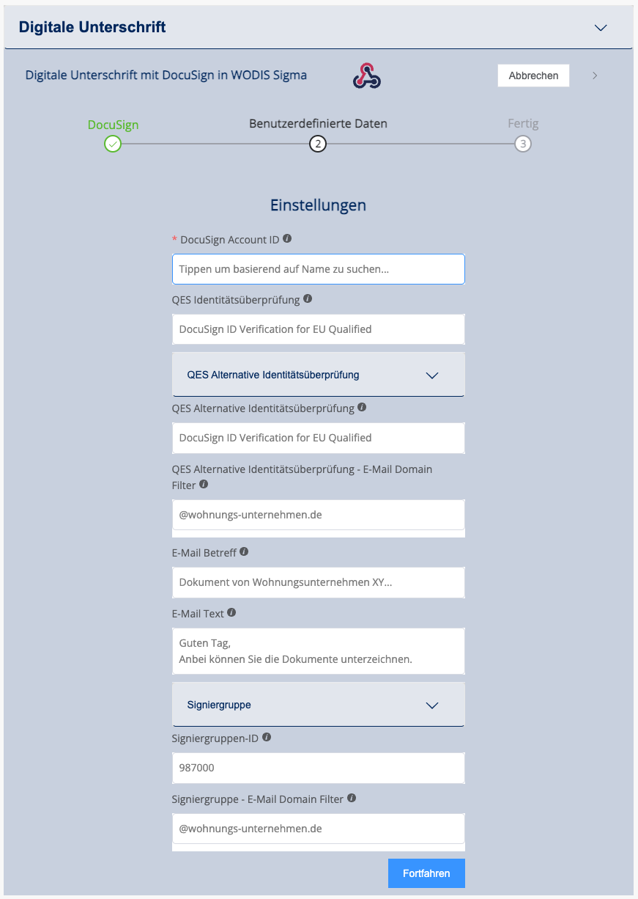

# Wodis Sigma

## Aareon Connect in Wodis Sigma aktivieren (Lizenzen Einlesen)

Nachdem Sie den Aareon Connect Vertrag unterschrieben haben muss die Lizenz noch in Wodis Sigma eingespielt werden werden:

1. Gehen Sie auf den Reiter **Start**
2.  Klicken Sie auf **Neu in dieser Version**

    <figure><figcaption></figcaption></figure>
3. Der Browser öffnet sich automatisch und führt Sie auf die Wodis Sigma Anwendungsserver Seite
4. Klicken Sie auf **Lizenzen**
5. Loggen Sie sich mit Ihrem Benutzer und Passwort ein
6. Klicken Sie auf **autom. Aktualisierung**
7.  Klicken Sie auf **Übernehmen**

    <figure><figcaption></figcaption></figure>
8.  Nach der Lizenzaktualisierung müssen Sie die Module den entsprechenden Benutzern zuordnen

    (frühestens zehn Minuten nach der Aktualisierung).
9. Dazu müssen Sie Wodis Sigma neu starten und sich (mit Admin-Rechten) neu anmelden.
10. Gehen Sie auf **Administration** > **Konfiguration** > **Stammdaten** >

    **Benutzer**
11. Wählen Sie jeweils die Benutzer aus, die Zugang erhalten sollen
12. Klicken Sie unter **Benutzerrechte** die Checkbox bei **Locoia-Administrator** an

    <figure><figcaption></figcaption></figure>
13. Gehen Sie auf **Administration** > **Konfiguration** > **Stammdaten** > **Zuordnungen** >

    **Benutzer – Applikation**
14. Wählen Sie jeweils die Benutzer aus, die Zugang erhalten sollen
15. Verschieben Sie das Modul **Integrations Platform as a Service** mit dem Einzelpfeil von links nach rechts\

    <figure><figcaption></figcaption></figure>
