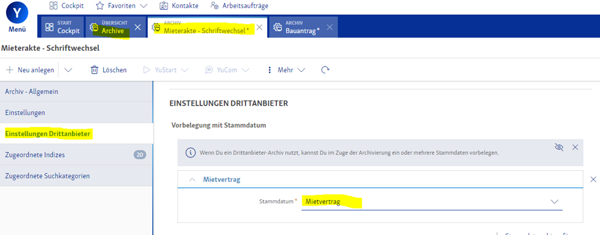

# Wodis Yuneo

## Aareon Connect in Wodis Yuneo aktivieren

### 1. Lizenzen Einlesen

Nachdem Sie den Aareon Connect Vertrag unterschrieben haben muss die Lizenz noch in Wodis Yuneo eingespielt werden werden:

1. Gehen Sie auf **Systemeinrichtung** > **Organisation und Datenmanagement** > **Lizenzen**
2.  Klicken Sie im Kopf-Menü auf **Mehr** > **Lizenzen vom Server importieren**\

    <figure><figcaption></figcaption></figure>
3. Bestätigen Sie den eingeblendeten Dialog mit **Importieren**

### 2. Aareon Connect öffnen

Um Aareon Connect in Wodis Yuneo zu öffnen und somit Integrationen zu aktivieren müssen Sie auf **Fachliche** **Einrichtung** > **Integrationen** > **Aareon Connect** gehen oder alternativ nach **Aareon Connect** in **YuSearch** suchen:

<figure><figcaption></figcaption></figure>

Somit öffnen sich Aareon Connect direkt in Wodis Yuneo:

<figure><figcaption></figcaption></figure>

## Use Cases

### Leerstände und Interessenten

#### Besonderheiten

Die Use Cases [Leerstände](../use-cases/leerstaende.md) und [Interessenten](../use-cases/interessenten.md) werden bei den Wodis ERPs nicht über eine klassische API Schnittstelle abgedeckt, sondern über die, in die ERPs eingebaute, Immoblue Funktion.

Dies hat den Vorteil, dass Sie das Mapping zwischen ERP und Partner Lösung ganz individuell bestimmen können.

Für das Mapping wird sich der Partner an Sie mit einer Mapping Tabelle wenden, welche dann an die Wodis Beratung weitergegeben wird, welche dieses Mapping entsprechend der Tabelle in Ihrem ERP vornehmen.

Entsprechend dauert der Go-Live Prozess in der Regel etwas länger als bei anderen Use Cases.


Das Trennzeichen der Objektnr. ist bei Wodis Yuneo immer `/`. Bei Wodis Sigma ist dieses frei konfigurierbar.

Je nach Partner gibt es ggf. bestimmte Vorschriften für das Trennzeichen.


### Dokumente

Im Zuge der Aktivierung des Dokumenten Use Cases, müssen Sie folgende Einstellungen ausfüllen:

| Name                      | Beschreibung                                                             | Optionen                                                                            |
| ------------------------- | ------------------------------------------------------------------------ | ----------------------------------------------------------------------------------- |
| Mieter Suchkategorien     | Suchkategorien der Archive, die dem Mieter zugeordnet werden sollen      | 
z.B. :

„Mieter Dokumente“,

„Mieter-Freigabe“,

usw.
         |
| Eigentümer Suchkategorien | Suchkategorien der Archive, die den Eigentümern zugeordnet werden sollen | 
z.B.:

„Eigentümer Dokumente“,

„Eigentümmer Freigabe“,

usw.
 |
| Schlagwort-Filter         | Schlagwörter/Begriffe die in dem Feld "Bemerkung" enthalten sind         |                                                                                     |

Nutzen Sie zur Übertragung bitte dieses [Formular](https://ivlv.me/OzjIv).

#### Archive

Bei der Bereitstellung von Dokumenten in einer Mieter- oder Eigentümer-App muss definiert werden, aus welchen Archiven Dokumente veröffentlicht werden, damit der Mieter oder Eigentümer keine Dokumente erhält, die nur für den internen Gebrauch vorgesehen waren. Bitte übergeben Sie uns eine Liste der **Suchkategorien**, welche in den zu übertragenden Archiven hinterlegt sind, aus denen wir die Dokumente veröffentlichen sollen.

Die vorhandenen Archive finden Sie in Yuneo, im kompakt Manager und im kompakt Client.

**1. Yuneo**

In der YuSearch „Archiv“ eingeben.

<figure><figcaption></figcaption></figure>

**2.Kompakt Manager- hier haben nur Admins Zugang**&#x20;

<figure><figcaption></figcaption></figure>

**Archive**

Im Menüband oben unter Archive werden die Einträge angezeigt

<figure><figcaption></figcaption></figure>

&#x20;

**3. Kompakt Client**

Öffnen Sie den **Kompakt Client**

<figure><figcaption></figcaption></figure>

**Archive**

Im Register Recherche oder Archivierung werden die Archive in den Suchkategorien oder auch in der Mitte unter dem Suchfeld Archiv angezeigt. Hier ein Demo-Archiv. Die Namen stimmen nicht mit Ihren überein.

<figure><figcaption></figcaption></figure>

### Protocols

Über den Use Case Protocols können Dokumente vom Partnersystem in Archiv kompakt übertragen werden. Bei der Übertragung des Dokumentes muss angegeben werden, in welches Archiv das Dokument abgelegt werden soll. Die Dokumente werden automatisch verschlagwortet. Dazu ist eine Einrichtung in Yuneo notwendig, damit das System die Indexwerte aus dem jeweiligen Stammdaten in Yuneo zuordnen kann.

Öffnen sie das Archiv in Yuneo zu dem Dokumente übertragen werden sollen, indem sie in der YuSearch "Archive" eingeben.

Im Register „Einstellungen Drittanbieter“ fügen sie ein neuen Eintrag in „Stammdatum hinzu und wählen den Stammdateneintrag aus, aus dem die Indexdaten bei der Ablage des Dokumentes gezogen werden sollen. Beispiel: Es sollen Dokumente in das Archiv Mietvertrag-Schriftwechsel übertragen werden, die Indexdaten sollen aus dem Mietvertrag gezogen werden.

Voraussetzung: Der Benutzer, mit dem die Dokumente übertragen werden, muss auch Archivrechte analog Use Case Dokumente haben.

<figure><figcaption></figcaption></figure>
