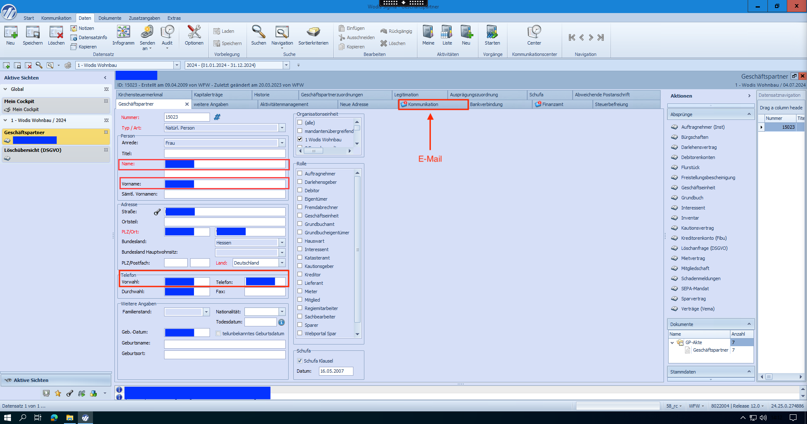
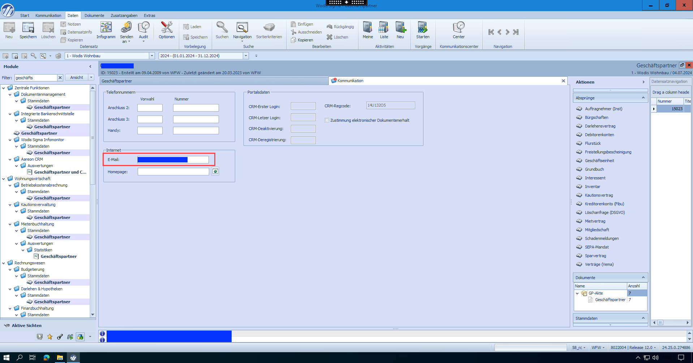

# Wodis Sigma

Initiale Einrichtung

### Lizenzen Einlesen

Lesen Sie wie [hier beschrieben](../../../erps/wodis-sigma.md#aareon-connect-in-wodis-sigma-aktivieren-lizenzen-einlesen) die aktuellen Lizenzen ein.

### Verknüpfung zwischen WODIS Sigma und Aareon Connect herstellen

Nachdem Sie die Digitale Unterschrift wie in [#aktivierung-in-aareon-connect](../scrive-technologie-partner.md#aktivierung-in-aareon-connect "mention") beschrieben aktiviert haben, muss zuletzt die Verknüpfung zwischen WODIS Sigma und Aareon Connect eingerichtet werden.

1. Gehen Sie auf **Zentrale Funktionen** > **Aktivitätenmanagement** > **Stammdaten** > **Aktivitätenmanagement Einstellungen**
2.  Tragen Sie für das Feld **Digitale Signatur Logins** den Wert **Scrive** in die Spalte **Benutzerwert** ein\

    <figure><figcaption></figcaption></figure>
3. Somit erscheinen die benötigten Felder
4. Tragen Sie die Daten, welche Sie nach der [#aktivierung-in-aareon-connect](../scrive-technologie-partner.md#aktivierung-in-aareon-connect "mention") erhalten haben in die entsprechenden Felder ein:
   1. **Benutzernamen** in das Feld **Scrive: Digitale Signatur User**
   2. das **Passwort** in das Feld **Scrive: Digitale Signatur Password**
   3. die **URL** in das Feld **Scrive: Digitale Signatur Url**
   4. und die **Authentication URL** in das Feld **Scrive: Digitale Signatur Auth Url**


Die Felder **Scrive: Digitale Signatur Fingerprint** und **Scrive: Digitale Signatur Tenant Id** können Sie leer lassen.


### Aktivitäten Einrichten

Um im Nachgang Aktivitäten für die digitale Unterschrift erstellen zu können, müssen diese zunächst erstellt werden. Es werden insgesamt 2 Aktivitäten benötigt, eine Aktivität für die **Anfrage der digitalen Signatur** und eine zur **Antwort auf die digitale Signaturanfrage**:

1. Gehen Sie auf **Aktivitätenmanagement > Stammdaten > Anlage von Aktivitäts-Standardwerten**
2. Klicken Sie im Reiter **Anlage von Aktivitätstypen** auf das Feld mit dem Typnamen **Aufgabe** und fügen Sie über das Hauptmenü eine neue hinzu.

<figure><figcaption></figcaption></figure>

#### Einrichten der Aktivität "Anfrage Digitale Signatur"

1. Die Berechtigungen für die Aktivität können im Reiter **Rechte** individuell vergeben werden
2. Im Reiter **Einstellungen** nehmen Sie die folgenden Änderungen vor
3. Setzen Sie im Bereich **Allgemein** den Haken bei **Der Aktivitätstyp gehört zur Kategorie:**&#x20;
   * Wählen Sie anschließend im **Dropdown-Menü** "**Externer Service**" aus
4. Setzen Sie im Bereich **Vorbelegungen** den Haken bei:&#x20;
   * **Benutze Standard-Betreff für neue Aktivitäten:** und tragen im freien Textfeld den Begriff **Anfrage Digitale Signatur** ein
   * **Benutze Informationen über das Stammdatum im Betreff für neue Aktivitäten**
   * **Benutze Standard-Fälligkeiten für neue Aktivitäten (in Tagen):** mit einem Intervall von **5** Tagen
5.  Jegliche Haken in den anderen Bereichen wie Outlook Synchronisation können Sie nach Belieben entfernen. Ihre Einstellungen sollten nun der Abbildung gleichen:

    

    <figure><figcaption></figcaption></figure>

    

#### Einrichten der Aktivität "Antwort auf digitale Signaturanfrage"

Wie auch bei der Einrichtung der vorherigen Aktivität können Sie zunächst Ihre gewünschten Berechtigungen vergeben und belegen dann die **Einstellungen** wie folgt:

1. Setzen Sie im Bereich **Allgemein** den Haken bei **Der Aktivitätstyp gehört zur Kategorie:**
   * Wählen Sie anschließend im **Dropdown-Menü** "**Externer Service**" aus
2. Setzen Sie im Bereich **Vorbelegungen** den Haken bei "**Benutze Informationen über das Stammdatum im Betreff für neue Aktivitäten**"
3. Alle anderen Haken in den Einstellungen können Sie entfernen. Ihre Einstellungen sollten nun der Abbildung gleichen:

<figure><figcaption></figcaption></figure>

### Jobplanung Einrichten

Die Jobs dienen dazu, die leeren Dokumente an Scrive zu übermitteln und die unterschriebenen Dateien von dem Technologiepartner abzufragen. Deshalb richten Sie in diesem Schritt **zwei Jobtypen** ein. Die Einrichtung mit unseren empfohlenen Einstellungen läuft wie folgt ab:

1. Gehen Sie in den Modulen über **Vorgangsmanagement** in das Fenster **Job Planung**. Hier richten sie die beiden nachfolgenden Jobs neu ein

<figure><figcaption></figcaption></figure>

2.  **Serienbrief für die Digitale Unterschrift aus Wodis in Scrive übertragen**

    1. Geben Sie die **Bezeichnung** **"Digitale Unterschrift Scrive verschicken"** ein
    2. Wählen Sie den **Jobtyp "Aktivitätenmanagement-DigitaleSignatur-Anfrage"** aus
    3. Setzen Sie den **Status** auf **"Freigegeben"**
    4. Legen Sie Ihren **Zeitplan** fest:
       * Wählen Sie im **Dropdown-Menü "Stuendlich"** oder **"Minuetlich"** aus und bestimmen Sie die Abstände, in denen die Schriftstücke an Scrive übermittelt werden (Best Practice: **12h**)
       * Achten Sie darauf, dass der Job mindestens an **allen Arbeitstagen** ausgeführt wird
    5. Geben Sie im Bereich **Konfiguration** Ihren gewünschten **Benutzer** in Blockschrift bei **"Ausführen als Benutzer:"** an.
    6. Fügen Sie den **Parameter "Digitale Signatur Logins"** mit dem **Wert "Scrive"** ([siehe hier](wodis-sigma.md#verknupfung-zwischen-wodis-sigma-und-aareon-connect-herstellen)) in das entsprechende Feld ein.
    7. **Speichern** Sie den Job über das **Hauptmenü**. Die nachfolgende Abbildung unterstützt Sie bei der Einrichtung.

    <figure><figcaption></figcaption></figure>
3. **Fertig unterschriebene Dokumente aus Scrive in Wodis übertragen**
   1. Geben Sie die **Bezeichnung** **"Digitale Unterschrift Scrive abholen"** ein
   2. Wählen Sie den **Jobtyp "Aktivitätenmanagement-DigitaleSignatur-Antwort"** aus
   3. Setzen Sie den **Status** auf **"Freigegeben"**
   4. Legen Sie einen **Zeitplan** fest:
      * Wählen Sie im **Dropdown-Menü "Stuendlich"** oder **"Minuetlich"** aus und bestimmen Sie die Abstände, in denen die Schriftstücke an Wodis übermittelt werden (Best Practice: **12h**)
      * Achten Sie darauf, dass der Job mindestens an **allen Arbeitstagen** ausgeführt wird
   5. Geben Sie im Bereich **Konfiguration** Ihren **Benutzer** in Blockschrift bei **"Ausführen als Benutzer:"** an
   6. Fügen Sie den **Parameter "Digitale Signatur Logins"** mit dem **Wert Scrive** ([siehe hier](wodis-sigma.md#verknupfung-zwischen-wodis-sigma-und-aareon-connect-herstellen)) in das entsprechende Feld ein
   7. **Speichern** Sie den Job über das **Hauptmenü**. Ihr fertig eingerichteter Job sollte wie die Abbildung aussehen

<figure><figcaption></figcaption></figure>

### Geschäftspartner Pflichtfelder befüllen

Damit die Unterzeichner (intern und extern) automatisch in die Aktivität eingetragen werden, müssen folgende Felder für alle Geschäftspartner eingetragen sein, die Unterzeichner sein sollten:

* Vorname
* Nachname
* Telefonnummer
* E-Mail

Dies können Sie hier in dem Geschäftspartner Modul eintragen:

<figure><figcaption>
Vorname, Nachname, Telefonnummer Konfiguration | Übergang zu E-Mail via <strong>Kommunikation</strong>
</figcaption></figure>

<figure><figcaption>
E-Mail Konfiguration
</figcaption></figure>

## Vorbereitung Ihrer Dokumente

Für die Digitale Unterschrift nutzen Sie wie gewohnt den Schriftverkehr in WODIS Sigma ([weitere Informationen](https://www.aareon.de/Support\_und\_Wissen/Dossier\_Schriftverkehr\_mit\_Wodis\_Sigma.212684.html) \[Verlinkung auf Aareon Support und Beratung, Zugang nur mit Login möglich]).

Verschiedenste Anchor Tags, die im Unterzeichnungsvorgang den passenden Unterzeichnern zugeordnet werden, sodass diese an den von Ihnen vorgesehenen Stellen Unterschreiben oder Felder ausfüllen, können hinzugefügt werden.

Dabei gibt es folgende Möglichkeiten:

* <mark style="background-color:blue;">Unterzeichner</mark>
  * Intern _- Unternehmensinternem (z.B. Sachbearbeiter_
  * Extern _- Externe Person (z.B. Mieter)_
* <mark style="background-color:purple;">Unterzeichner Nummer</mark> - _Zuordnung der Unterzeichner innerhalb der jeweiligen Internen bzw. Externen Unterzeichner_
* <mark style="background-color:orange;">Feldart</mark>
  * Unterschrift
  * Unterschriftsdatum _- Das aktuelle Datum_
  * Datum
  * Name
  * Checkbox
  * Text
  * Email
  * Initialen _- Die jeweils ersten Buchstaben des Vor- und Nachnamens (z.B. bei Erika Mustermann: EM)_
* <mark style="background-color:green;">Feld Nummer</mark> _- Zuordnung der Felder innerhalb der jeweiligen Feldarten_
* <mark style="background-color:red;">Feldeigenschaft</mark>
  * \* _- Das Feld muss zwingend ausgefüllt werden_
  * ? _- Das Feld kann ausgefüllt werden_

Dies muss in der folgenden Syntax zusammengesetzt werden (die einzelnen Bestandsteile sind farblich markiert), hier z.B. für das erste Unterschriftsfeld für den ersten internen Unterzeichner:

DU.<mark style="background-color:blue;">Intern</mark>.<mark style="background-color:purple;">01</mark>.<mark style="background-color:orange;">Unterschrift</mark>.<mark style="background-color:green;">01</mark><mark style="background-color:red;">\*</mark>

Das dritte optionale E-Mail Feld für den zweiten externen Unterzeichner muss entsprechend wie folgt in dem Dokument hinterlegt werden:

DU.<mark style="background-color:blue;">Extern</mark>.<mark style="background-color:purple;">02</mark>.<mark style="background-color:orange;">Email</mark>.<mark style="background-color:green;">03</mark><mark style="background-color:red;">?</mark>


Die Syntax muss genau befolgt werden (inkl. Groß- und Kleinschreibung), damit die Anchor Tags ausgelesen werden können.

Alle Anchor Tags müssen mit **DU.** starten.


Die Anchor Tags sollten mit weißer Schrift in den Dokumenten hinterlegt werden, damit diese für die Unterzeichner nicht sichtbar sind, aber vom ERP und Scrive ausgelesen werden können.

## Prozess je Dokument

### Einrichten und Versenden von Dokumenten

#### 1. Serienbrief Erstellung&#x20;

1. Gehen Sie auf **Mietenbuchhaltung** > **Stammdaten** > **Mietvertrag**
2. Wählen Sie im Kopf-Menü **Dokumente > Schriftverkehr**.
3. Wählen Sie nun unter **Dokumente > Schriftverkehr > Anschreiben** die Anschreibeart **Mietvertrag** aus.
4. Laden Sie den Mietvertrag.
5. Wählen Sie unter  **Dokumente > Schriftverkehr > Archivierung**  bei **„Auswahl Dokumententyp für Serienbrief**“ die Option **Mietvertrag**.
6. Setzen Sie einen Haken bei **Serienbrief sofort archivieren**.
7. Gehen Sie zurück auf **Dokumente > Schriftverkehr > Anschreiben** und wählen Sie **Anschreiben drucken**. Damit wird der Serienbrief erstellt.

#### **2. Dokument-ID ermitteln (**_**optional**_**)**

1. Kehren Sie zum Menü **Mietenbuchhaltung** > **Stammdaten** > **Mietvertrag** zurück.
2. Wählen Sie oben **Dokumente > Recherche**.
3. Unter **Dokumententyp** wählen Sie **Mietvertrag** und geben das Erstellungsdatum ein.
4. Klicken Sie auf **Ausführen** und notieren Sie sich die Dokumentennummer des passenden Dokuments.


Sie können die Dokumenten-ID auch direkt während der Aktivitäten Erstellung in Schritt 4. über verschiedene Filter-Parameter suchen.


#### 3.  Aktivität anlegen

1. Gehen Sie zurück auf den Mietvertrag und wählen Sie oben **Daten > Aktivitäten > Neu**.
2. **Anfrage für Digitale Signatur** sollte nun ausgewählt sein.
3. Wählen Sie **Daten** > **Anhang**.
4. Geben Sie die notierte Nummer ein und klicken Sie auf **Suchen**.
5. Neben **Dokumentauswahl** klicken Sie auf das **+** und dann auf **Übernehmen**.
6. Unter **Digitale Signaturanker** sehen Sie das automatische Auslesen und die Zuordnung der Anchors
7. _Optional:_ Geben Sie unter **Email-Adresse für vor Ort Unterschrift** eine E-Mail Adresse (z.B. E-Mail die auf einem iPad angezeigt wird) ein, damit ein Mieter direkt vor Ort unterschreiben kann. Fügen Sie hinter dem Unterzeichner-Tag des Mieters ein Komma, ein Leerzeichen und „vor Ort“ ein.\
   Mehr Details zur [#vor-ort-unterschrift](../scrive-technologie-partner.md#vor-ort-unterschrift "mention")
8.  _Optional:_ Geben Sie unter **E-Mail Adressen für Beobachter** eine oder mehrere E-Mail Adressen kommasepariert ein, welche als Beobachter zu dem Umschlag hinzugefügt werden (ähnlich wie jemanden in einer E-Mail CC nehmen).

    Diese Empfänger werden dann per E-Mail über den Vorgang informiert und können sich den Umschlag in Scrive / DocuSign ansehen, aber nicht unterschreiben.
9. Wählen Sie eine Authentifizierungsart unter **Authentifizierung zum Signieren**
10. Die Unterschrifts-Reihenfolge wird mit den letzten Zahlen jeder Zeile angegeben. Diese können Sie frei bearbeiten.
    1. Standardmäßig haben alle externen Unterzeichner die Reihenfolge 1 und alle internen Unterzeichner die Reihenfolge 2.
11. Klicken Sie auf **Speichern**, um die Aktivität abzuspeichern und das Dokument zu versenden.

<figure><figcaption>
Aktivitäten Aufgaben Tab mit ausgefüllten <strong>E-Mail Adressen für Beobachter</strong>
</figcaption></figure>


Die Reihenfolge der hinzugefügten Anhänge in Wodis Sigma entspricht der Reihenfolge der Dokumente in Scrive.


#### 4. Versenden der Dokumente

Das Dokument wird mit der nächsten geplanten Ausführung des Arbeitsauftrags ([#arbeitsauftraege-einrichten](wodis-sigma.md#arbeitsauftraege-einrichten "mention")) versendet.

Alternativ kann der Arbeitsauftrag auch ad-hoc ausgeführt werden:

1. Gehen Sie zu **Zentrale Funktionen > Job Planung** und wählen Sie die entsprechende Aktivität aus.
2. Setzen Sie unter **Zeitplan** > **nächste Ausführung** eine zeitnahe Uhrzeit und den Status auf **Freigegeben**.
3. Klicken Sie auf **Speichern**

#### 5.  Abholen des unterschrieben Dokuments

1. Mit der Ausführung der Aktivität **Digitale Signatur Scrive abholen**, werden alle unterschriebenen Dokumente abgeholt
   1. Alternativ kann der Arbeitsauftrag auch wie in [#id-4.-versenden-des-dokumente](wodis-sigma.md#id-4.-versenden-des-dokumente "mention") ad-hoc gestartet werden
2. In der Aktivitätenliste (**Mietvertrag > Daten** > **Listen**) können Sie eine Übersicht aller Aktvitäten einsehen.
3. Im Anhang der Digitalen Unterschriftsaktivität befindet sich das unterschriebene Dokument mit dem Siegel von Scrive.


Die Aktivitäten Erstellung erfolgt immer in dem Mietvertrag, von dort können ebenfalls Dokumente versendet werden die in einem anderem Modul erstellt wurden.


**Schritte zur Erstellung eines nicht-Mietvertrag Dokuments am Beispiel Kautionsvertrag**

1. **Schriftverkehr erstellen**:
   * Gehen Sie in das Modul, das für Kautionsverträge vorgesehen ist.
   * Erstellen Sie den Schriftverkehr für den Kautionsvertrag. Dieser Schritt erfolgt ähnlich wie bei einem Mietvertrag. Beachten Sie, dass die Benutzeroberfläche hier leicht abweichend gestaltet ist.
2. #### **Dokument-ID ermitteln**
   * Ermitteln Sie die ID des erstellten Dokuments, genau wie Sie es bei einem Mietvertrag tun würden.

**Integration mit Mietvertrag**

3. **Aktivität im Mietvertrag anlegen**:
   * Erstellen Sie nun eine Aktivität im Mietvertrag-Modul.
   * Wählen Sie dabei das zuvor archivierte Kautionsvertrags-Dokument aus.
4. **Bündelung der Dokumente**:
   * Der Ablauf sieht vor, dass Sie zunächst alle benötigten Dokumente in ihren jeweiligen Modulen erstellen.
   * Anschließend senden Sie diese Dokumente gebündelt über das Mietvertrag-Modul.
