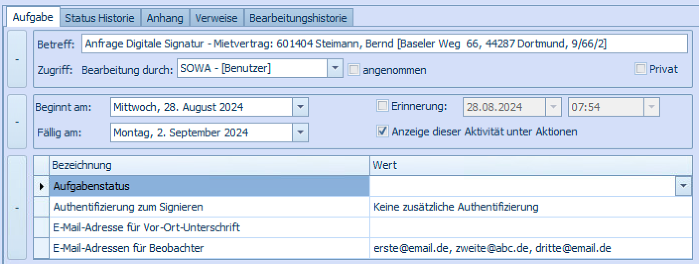

# Scrive - Technologie Partner

Aareon arbeitet mit **Scrive** für die digitale Unterschrift zusammen, dem führenden B2B-Unterschriftsanbieter aus Europa:

<figure><figcaption>
Kurzübersicht Scrive in Zahlen
</figcaption></figure>


Seit Dezember 2023 ist unser Technologie Partner Scrive, mit dem wir Ihnen mehr und komfortablere Unterschrifts-Lösungen anbieten können.\
Bestandskunden, werden über die kommenden Jahre von DocuSign zu Scrive migriert, damit Sie auch von den neuen Funktionen profitieren können.


Scrive ist ein ISO/IEC 27001:2022 zertifizierter Signaturdienst welcher 2010 gegründet wurde und heute zu führenden Anbietern für digitale Signaturen in Nordeuropa zählt.

Weitere generelle Informationen zu Scrive, finden Sie [hier auf der Scrive Website](https://www.scrive.com/de).

Das Scrive Helper Center mit ausführlichen [Artikeln zu verschiedensten Themen finden Sie hier](https://helpcenter.scrive.com/kb/en) (Englisch).

## Vorteile Scrive

Aareon hat sich entschieden den Technologie Partner zu wechseln um Ihnen folgende Vorteile bieten zu können:

* Account Erstellung in nur 1-3 Tagen nach Unterzeichnung des Angebots von Aareon möglich
* Besonders tiefe und stabile Integration in ERPs
* Einfache und intuitive Nutzung in den [erps](erps/ "mention") und mit [#standalone-nutzung-ohne-erp-system](scrive-technologie-partner.md#standalone-nutzung-ohne-erp-system "mention")
* Transparenteres Preismodell
* Scrive hat seinen primären Firmensitz in der EU

## Initiale Einrichtung in Scrive

Diese Schritte müssen Sie nur einmalig durchführen, um danach die integrierte Digitale Unterschrift voll-integriert zu nutzen.

### 1. Initiale Registrierung

1. Kurz nachdem Sie den Digitalen Unterschrifts-Vertrag abgeschlossen haben, erhalten Sie eine Einladungs-E-Mail wie diese von Scrive:

<figure><figcaption></figcaption></figure>

2. Nachdem Sie auf **Kontoaktivierung** klicken, können Sie ein Passwort und weitere Informationen hinterlegen:

&#x20;

<figure><figcaption></figcaption></figure>


Im Hintergrund haben wir für Sie nach Vertragsabschluss ein Account bei Scrive angelegt und einen initialen Admin Nutzer erstellt. Dieser initiale Nutzer erhält die gezeigte E-Mail.

Der initiale Benutzter ist standardmäßig einer Ihrer ERP Administratoren.


### 2. Branding & Corporate Identity Personalisierung

#### Basis Branding

Das Scrive Design können sie in wenigen Schritten auf das Branding Ihres Unternehmens umstellen (auch genannt white-labeln):

1. Im linken Seitenmenü auf [**Konto** > **Branding**](https://scrive.com/new/branding) gehen
2. Im Reiter **E-Mail** das Auswahlsfeld **E-Mail-Design** öffnen und **Neues Design…** auswählen
3. Name für das neue Design festlegen, z.B. **Ihr Unternehmen Design**
4. Nun können Sie das Design in den jeweiligen Reitern anpassen: Links können Sie Einstellungen vornehmen, rechts sehen Sie direkt eine Live-Vorschau
5. Oben rechts auf **SPEICHERN** klicken


[Weiterführende Informationen in der Scrive Dokumentation](https://helpcenter.scrive.com/kb/guide/en/branding-customisation-GL7Thj4mYF) (Englisch)


#### Erweitertes Branding

Erweitertes Branding (white labeling) beinhaltet die folgenden zusätzlichen Optionen:

1. Nutzen sie Ihre eigene **Firmenname in der Sub-Domain**, z.B. www.{firmenname}.scrive.com
2. **SMS-Absender** mit Ihrem Firmenname: Der Name, der dem Empfänger beim Empfang einer SMS angezeigt wird. Maximal 11 alphanumerische Zeichen.
3. **E-Mail-Absender** mit Ihrem Firmennamen: Der Firmenname, der dem Empfänger beim Empfang von E-Mails angezeigt kann geändert werden.\
   Beispiel: Ändert die Zeichenfolge "Max Müller über Scrive" in > "Max Müller über {Firmenname}"


{Firmenname} wird bei erweitertem Branding durch Ihren individuellen Namen ersetzt. Im Basis-Branding würde dort immer Scrive stehen, der Name der Unterschrifts-Lösung.



Erweitertes Branding ist mit **Zusatzkosten** verbunden und muss gesondert **beantragt werden**.


### 3. Nutzer Einladen

Um unterschriebene Dokumente auch außerhalb des ERPs einzusehen oder zu versenden, können Sie weitere Personen aus Ihrem Unternehmen zu Scrive einladen.

Für die Aktivierung der Digitalen Unterschrift mit Scrive in Aareon Connect, empfehlen wir zudem einen Admin Nutzer anzulegen, welcher nur für die Integration genutzt wird.

1. Im linken Seitenmenü auf [**Konto** > **Nutzer und Gruppen**](https://scrive.com/new/users) gehen
2. Oben links **NEUE NUTZER** klicken
3. Nötige Felder ausfüllen
   1. [Übersicht der verschiedenen Nutzerrollen](https://helpcenter.scrive.com/kb/guide/en/user-administration-hu176Qf8cO/Steps/1446349,1446480) (Englisch)
4. **EINLADEN** klicken
5. Der neue Benutzter erhält eine E-Mail wie in [#1.-initiale-registrierung](scrive-technologie-partner.md#1.-initiale-registrierung "mention") beschrieben


Sie können ohne Zusatzkosten so viele Nutzer wie Sie benötigen zu Scrive hinzufügen.


Nun können Sie mit der [#aktivierung-in-aareon-connect](scrive-technologie-partner.md#aktivierung-in-aareon-connect "mention") fortfahren.

## Aktivierung in Aareon Connect

Nachdem Sie die [#initiale-einrichtung-in-scrive](scrive-technologie-partner.md#initiale-einrichtung-in-scrive "mention") abgeschlossen haben, können Sie die Digitalen Unterschrift mit Scrive in Aareon Connect zu aktivieren:

1. Öffnen Sie **Aareon Connect** in Ihrem ERP System ([mehr Details](../../#aareon-connect-per-video-verstehen))
2. Gehen Sie auf **Scrive**
3.  Geben Sie bei der Integration **Digitale Unterschrift mit Scrive** die Zugangsdaten für den Scrive Nutzter ein (muss ein Admin Nutzer sein), den Sie für die Integration verwenden möchten

    1. Wie in [#3.-nutzer-einladen](scrive-technologie-partner.md#3.-nutzer-einladen "mention") beschrieben, empfehlen wir, dass Sie einen Admin Nutzer speziell für die Integration nutzen um Probleme bei z.B. Passwort Änderung eines regulären Nutzers zu vermeiden

    <figure><figcaption></figcaption></figure>
4. Klicken Sie auf **Autorisieren**
   1. Die Nutzerdaten werden direkt überprüft und bei falschen Informationen erhalten Sie eine Meldung mit weiteren Informationen
5. Die Integration ist nun aktiviert
6. Sie erhalten somit in den kommenden Stunden via E-Mail die nötigen Informationen um die Integration im ERP System fertig einzurichten

## Ablauf von QES in Scrive

Mehr Details zu [#qualifizierte-elektronische-unterschrift](./#qualifizierte-elektronische-unterschrift "mention") finden Sie im verlinkten Artikel.

Der Ablauf von QES unterscheidet sich je nachdem, ob QES das erste Mal von den jeweiligen Unterzeichnern genutzt wird oder dieser bereits registriert ist. Die ersten Prozessschritte sind allerdings in beiden Fällen identisch

1. Alle Unterzeichner erhalten eine reguläre E-Mail zum Unterzeichnen
2.  Auf der Seite zum Unterschreiben wird nach der Mobilnummer des Unterzeichners gefragt:\

    <figure><figcaption></figcaption></figure>

    1. Falls die Mobilnummer bereits im ERP hinterlegt ist, wird immer die Mobilnummer aus dem ERP genutzt
3. Nun wird von Swisscom geprüft, ob die Mobilnummer bereits mit QES registriert wurde, wenn dies _nicht_ der Fall ist, ist, dann geht der Prozess bei [#initiale-nutzung-von-qes-inklusive-registrierung-qes-mit-srs](scrive-technologie-partner.md#initiale-nutzung-von-qes-inklusive-registrierung-qes-mit-srs "mention") weiter, ansonsten geht der Prozess bei [#erneute-nutzung-von-qes](scrive-technologie-partner.md#erneute-nutzung-von-qes "mention") weiter.

#### Initiale Nutzung von QES inklusive Registrierung (QES mit SRS)

4.  Der Unterzeichner erhält die Möglichkeit sich entweder via Video-Identifikation oder Persönlich auszuweisen:\

    <figure><figcaption></figcaption></figure>


Alle weiteren beschriebenen Prozessschritte basieren auf der Auswahl von **Video-Identifikation**


5. Der Unterzeichner kann sich die **Mobile ID** App herunterladen ("Wallet") ODER später per Einmal-SMS-Code unterschreiben
   1. _Optional_: Der Unterzeichner folgt der Anleitung der Mobile ID App

<figure><figcaption></figcaption></figure>


Wir empfehlen das herunterladen der App für alle Unterzeichner Ihres Unternehmens, dies ermöglicht bei [#erneute-nutzung-von-qes](scrive-technologie-partner.md#erneute-nutzung-von-qes "mention") einen sehr schnellen und bequemen Prozess um Dokumente mit QES zu unterschreiben


6. Der Unterzeichner muss die angezeigte Video-Identifikation App herunterladen
   1. Der Unterzeichner folgt der Anleitung des Video-Identifikation Prozesses, welcher Schritt-für-Schritt in der App erklärt wird
7. Nach erfolgreichem ausweisen im Video-Identifikation Prozesses muss der Unterzeichner die Swisscom AGB via Aufruf eines Links (wird per SMS gesendet) bestätigen
8. Der Unterzeichner klickt **Fortfahren** auf dem Dialog aus Schritt 5.
9. Dieser erhält nun entweder eine Push-Benachrichtigung von der Mobile ID App oder einem Einmal-Code via SMS
10. Die Unterschrift wird entweder durch Knopfdruck in der Mobile ID App oder Eingabe des Einmal-Code im Browser bestätigt
11. Das Dokument ist somit vom jeweiligem Unterzeichner unterschrieben

#### Erneute Nutzung von QES (mit Mobile ID App)

4. Der Unterzeichner erhält eine Push-Benachrichtigung von der Mobile ID App
5. Die Unterschrift wird durch Knopfdruck in der Mobile ID App bestätigt
6. Das Dokument ist somit vom jeweiligem Unterzeichner unterschrieben

### Besonderheiten bei der Nutzung von QES

Bei der Nutzung von QES sind folgende Besonderheiten zu beachten:

* Die zu unterschreibenden Dokumente dürfen keine auszufüllenden Felder enthalten und die Unterschrift erfolgt visuell nicht auf dem Dokument direkt
* Alle Unterzeichner des Dokumentes müssen mit QES unterschreiben
* Alle Unterzeichner benötigen eine gültige Mobilnummer (es ist _nicht_ erforderlich, dass dies im ERP hinterlegt ist)

## Vor-Ort-Unterschrift - In Entwicklung

Mit der Vor-Ort-Unterschrift können Ihre Kunden Verträge direkt bei Ihnen vor Ort digital unterschreiben, z.B. auf einem iPad oder Computer eines Mitarbeiters.

Dafür können Sie bei dem Versenden eines Dokuments im ERP eine E-Mail Adresse angeben, an welche die Unterzeichnungs-Links gesammelt zum Unterschreiben gesendet werden sollen (mehr Details in [#funktionsumfang-und-roadmap-je-erp](erps/#funktionsumfang-und-roadmap-je-erp "mention")).

Diese E-Mail kann dann vor Ort geöffnet werden und die Unterzeichner öffnen ihren jeweiligen Link:

<figure><figcaption></figcaption></figure>

Die Unterzeichnungs-Bestätigung inklusive Kopie des unterzeichneten Dokuments wird weiterhin an die jeweiligen eigenen E-Mail Adressen der Unterzeichner gesendet.


Die Unterzeichner die vor Ort unterschreiben sollen können frei ausgewählt werden.\
Somit müssen nicht alle Unterzeichner vor Ort unterschreiben.


## Standalone - Nutzung ohne ERP System

Sie können Scrive auch direkt in der Scrive Oberfläche nutzen, dies ist in folgenden Fällen hilfreich:

* Sie wollen einen individuelle Vertrag der nicht im ERP System erzeugt wird verschicken
* Der Dokumenttyp wird nicht von der Digitalen Unterschrift in Ihrem ERP unterstützt (mehr Details in [#funktionsumfang-und-roadmap-je-erp](erps/#funktionsumfang-und-roadmap-je-erp "mention"))


Dokumente die über Scrive direkt verschickt werden, werden nicht automatisch an das ERP übertragen.\
Sie können die Dokumente natürlich manuell zum ERP hinzufügen.


### Ablauf

1. In Scrive einloggen (mehr Details in [#1.-initiale-registrierung](scrive-technologie-partner.md#1.-initiale-registrierung "mention"))
2. Links oben auf [**Neuer Prozess**](https://scrive.com/new/newprocess) klicken&#x20;

<figure><figcaption></figcaption></figure>

1. Entweder basierend auf einer Vorlage ([mehr Details zu Vorlagen im Scrive Help Center](https://helpcenter.scrive.com/kb/guide/en/work-with-templates-iE16m1KJwL/Steps/1659917)) oder mit **Start** einen neuen Prozess beginnen
2. Fügen Sie unter **Parteien** die Personen hinzu die unterschreiben sollen
   1. Sie können auch weitere Einstellungen wie z.B. Nutzung von QES konfigurieren
3. Laden sie bei **Dokument** das zu unterschreibende Dokument hoch
4. Fügen Sie auszufüllende Felder und ein Signatur Feld ein
5. Unter **Einstellungen** können Sie optional weitere Einstellungen wie z.B. ein Fälligkeitsdatum einstellen


Detaillierte Informationen finden Sie im [Scrive Helpcenter auf Englisch](https://helpcenter.scrive.com/kb/en/set-up-a-new-process-252682)

