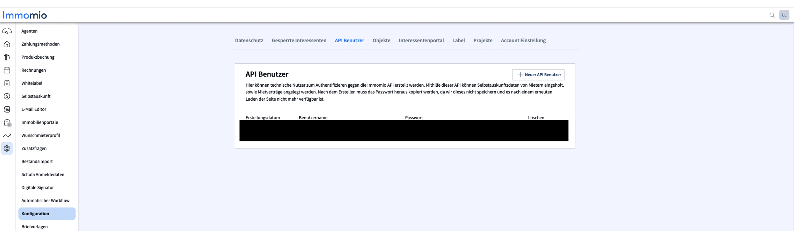

# Immomio

## Übersicht

* **Kategorien**: [Interessentenmanagement](../kategorien/interessentenmanagement.md), [Mieterkommunikation](../kategorien/mieterkommunikation.md)
* **Use Cases**: [Stammdaten](immomio.md#stammdaten), [Interessenten](../kategorien/interessentenmanagement.md)
* **Marketplace**: [Immomio](https://marketplace.aareon.com/de/listings/immomio)

## Beschreibung

Immomio - Die 360° Plattform für die Wohnungswirtschaft. Von der Neubauprojekt-Vermarktung, über die Bestandsvermietung, den digitalen Mietvertrag bis zur Mieterapp. Mit den digitalen Lösungen von Immomio verbinden Sie alle Prozesse rund um Ihre Wohnungen und Mieter.

## Mit Immomio verbinden


HINWEIS: Für eine Integration wird zum sauberen Testen eine **Sandbox von Immomio benötigt**. Bitte wenden Sie sich mit **ausreichend Vorlauf** an Ihren Account Manager, damit diese beantragt und eingerichtet werden kann und dieser Vorgang den Integrations-Zeitplan nicht verzögert.


1. Um einen Immomio-Use-Case zu nutzen benötigen Sie zur Aktivierung die **Immomio API Zugangsdaten**. Diese finden Sie folgendermaßen:
   1. Klicken Sie auf der **Task-Leiste** zur linken auf das **Steuerrad**
   2. Klicken Sie dort auf **Konfiguration**
   3. Daraufhin wird sich eine Seite öffnen, wo oben **API Benutzer** steht. Hier können neue API Zugangsdaten erstellt oder existierende abgerufen werden. Speichern Sie sich ihren **API Benutzername** und das **Passwort** ab. Diese werden für die Aktivierung im ERP benötigt.

<figure><figcaption></figcaption></figure>

2. Nachdem Sie Aareon Connect Kunde geworden sind, können Sie die verfügbaren **Immomio Integrationen innerhalb Ihres ERP-Systems** auswählen und aktivieren. Mehr Details dazu finden Sie hier[^1].

### **Sonderfall: DIT System**

Sollte Ihr Immomio Account über ein altes DIT System laufen, werden sie zusätzlich FTP Zugangsdaten bereitstellen müssen. Diese sind innerhalb von Immomio folgendermaßen zu finden:

1. &#x20;Klicken Sie auf der **Task-Leiste** zur linken auf das **Steuerrad**
2. Klicken Sie dort auf **Bestandsimport**
3. Hier können die benötigten Zugangsdaten abgerufen werden:

<figure><figcaption></figcaption></figure>

## Use Cases

### 1. Leerstände & Interessenten

#### Übersicht

* [Leerstände](../use-cases/leerstaende.md)
* [Interessenten](../use-cases/interessenten.md)

| ERP                                           | Immomio              |
| --------------------------------------------- | -------------------- |
| [Leerstand](../entitaeten/leerstaende.md)     | Leerstand            |
| [Interessent](../entitaeten/interessenten.md) | Interessent / Mieter |

#### Einstellungen

| Name                               | Beschreibung                                                                                                                        | Optionen                 |
| ---------------------------------- | ----------------------------------------------------------------------------------------------------------------------------------- | ------------------------ |
| Separator für zusammengesetzte IDs | Dieser Separator wird genutzt um die IDs in dem Partner System aus den ERP Nummern zusammenzusetzen, sodass die IDs eindeutig sind. | `-`, `_`, `.`, `/`, `\|` |
| Mandanten Nummern                  | Es werden nur Daten für die eingetragenen Mandanten synchronisiert.                                                                 |                          |

#### Test der Integration

Nachdem Sie die Integration aktiviert haben und die ersten Leerstände in Ihrem Immomio Account zusehen sind, prüfen Sie bitte, ob alle Daten wie gewünscht übertragen wurden. Eine Checkliste dazu finden Sie hier:

* Wurden die Einheitstypen richtig überspielt?
  * Gewerbe, Wohnen, Parkplatz
* Ist die Anzahl der Leerstände korrekt übertragen worden?
* Sind die Felder richtig angekommen
  * Adresse
  * Details
    * Objekt ID
    * Anzahl Räume
    * Etage
    * Baujahr
    * Verfügbarkeitsdatum
    * Fehlen welche?
* Kosten:&#x20;
  * Grundmiete
  * Gesamtmiete
  * Heizkosten
  * Betriebskosten
* Ist die Ausstattung korrekt übertragen:&#x20;
  * Keller
  * Einbauküche
  * Gegensprechanlage
  * Aufzug
  * Fahrradraum
  * Gäste WC
  * Fehlen welche?
* Energieeffizienz
  * Zentral Heizung
  * Fehlen welche?

### 2. Stammdaten

#### Übersicht

* [Allgemeine Informationen](../use-cases/stammdaten.md)
* [Feld Mapping](https://docs.google.com/spreadsheets/d/1b5iCRsnGxBGTXNzHzaNm0SlfRoIpbRofghzS-7HwbVc/edit#gid=1213044489\&fvid=23969279)

#### Entitäten

| ERP                                                            | Immomio              |
| -------------------------------------------------------------- | -------------------- |
| [Wirtschaftseinheiten](../entitaeten/wirtschaftseinheiten.md)  | Wirtschaftseinheiten |
| [Gebäude](../entitaeten/gebaeude.md)                           | _Kommt in Kürze_     |
| [Verwaltungseinheiten](../kategorien/eigentuemerverwaltung.md) | Verwaltungseinheiten |
| [Mietverträge](../entitaeten/mietvertraege.md)                 | _Kommt in Kürze_     |
| [Mieter](../entitaeten/mieter.md)                              | _Kommt in Kürze_     |
| [Eigentümervertrag](../entitaeten/eigentuemervertraege.md)     | _Kommt in Kürze_     |
| [Eigentümer](../entitaeten/eigentuemer.md)                     | _Kommt in Kürze_     |

#### Einstellungen

| Name                               | Beschreibung                                                                                                                        | Optionen                 |
| ---------------------------------- | ----------------------------------------------------------------------------------------------------------------------------------- | ------------------------ |
| Separator für zusammengesetzte IDs | Dieser Separator wird genutzt um die IDs in dem Partner System aus den ERP Nummern zusammenzusetzen, sodass die IDs eindeutig sind. | `-`, `_`, `.`, `/`, `\|` |
| Mandanten Nummern                  | Es werden nur Daten für die eingetragenen Mandanten synchronisiert.                                                                 |                          |

#### Voraussetzungen

* Es werden nur Mieter mit einer hinterlegten E-Mail Adresse synchronisiert
  * Mietverträge von Mietern, die dies nicht erfüllen, werden ebenfalls nicht synchronisiert

[^1]: (Link zu ERP overview)
